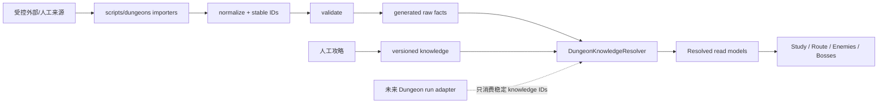

# 架构与数据模型设计

## 1. 领域边界

推荐新增独立 `src/dungeon/**` 领域，并在 `src/interface/routes/dungeons/**` 提供路由入口。Dungeon Knowledge 不依赖 `CombatLogParser`、Analyzer 或 ReportContext。



### 1.1 依赖方向

```text
interface/routes/dungeons → dungeon/runtime → dungeon/data + dungeon/knowledge
scripts/dungeons          → dungeon/schema
parser/analysis           ✕ dungeon（当前阶段无依赖）
```

未来 WCL 连接采用 `DungeonRunKnowledgeAdapter`，由新的运行复盘域引用 Dungeon Knowledge；Dungeon Knowledge 不反向引用 parser。

## 2. 建议目录

```text
src/dungeon/
├── schema/
│   ├── common.ts
│   ├── raw.ts
│   ├── knowledge.ts
│   ├── route.ts
│   └── validation.ts
├── catalog/
│   └── seasons.ts
├── data/generated/midnight-s2/
│   ├── manifest.ts
│   └── <dungeon-slug>/
│       ├── index.ts
│       ├── dungeon.json
│       ├── enemies.json
│       ├── spawns.json
│       └── maps.json
├── knowledge/midnight-s2/
│   └── <dungeon-slug>/
│       ├── overview.ts
│       ├── abilities.ts
│       ├── bosses.ts
│       ├── routes.ts
│       └── quiz.ts
├── runtime/
│   ├── loadDungeon.ts
│   ├── resolveDungeonKnowledge.ts
│   ├── derivePull.ts
│   ├── coordinateTransform.ts
│   └── progressVersion.ts
├── ui/
│   ├── DungeonLayout/
│   ├── Study/
│   ├── Map/
│   ├── Enemies/
│   ├── Bosses/
│   └── shared/
└── __tests__/

src/interface/routes/dungeons/
├── layout.tsx
├── index.tsx
├── study.tsx
├── route.tsx
├── enemies.tsx
└── bosses.tsx

scripts/dungeons/
├── sources/
├── import.ts
├── normalize.ts
├── generate.ts
├── validate.ts
├── report.ts
└── fixtures/
```

生成目录由脚本管理并带 `DO NOT EDIT`；知识目录由人维护。

## 3. 三层数据模型

### 3.1 Raw Facts

只描述可验证的游戏事实：ID、地图、坐标、spawn、enemy forces、怪物/技能关系、Boss 顺序、事实属性。可重新生成覆盖。

### 3.2 Authored Knowledge

描述玩家应如何理解和处理：危险度、动作、后果、Pull 解释、角色建议、记忆句、自测、来源和适用版本。

### 3.3 Resolved Read Model

Resolver 在非 React 层组合两者，产出 UI 需要的稳定对象：

- 已解析名称和 fallback 状态。
- Pull 的怪物组成、forces、累计 forces。
- 按严重度排序的关键技能。
- 角色高亮后的建议。
- 来源、过期状态和内容完成度。

React 不直接 join 多个 JSON，也不自行计算路线总量。

## 4. 核心 TypeScript Schema 草案

以下是方向性接口，Phase 0 应用真实 S2 样本验证后冻结 v1。

```ts
type SeasonId = string;
type DungeonId = string;
type FloorId = string;
type SpawnId = string;
type RouteId = string;
type PullId = string;
type SituationId = string;
type KnowledgeId = string;

interface ContentVersion {
  schemaVersion: 1;
  gamePatch: string;
  dataRevision: string;
  validFrom?: string;
  validUntil?: string;
  generatedAt?: string;
  verifiedAt?: string;
}

interface MythicPlusSeason {
  id: SeasonId;
  expansion: 'midnight';
  season: 2;
  patch: string;
  status: 'ptr' | 'live' | 'archived';
  dungeonIds: DungeonId[];
  version: ContentVersion;
}

interface DungeonRaw {
  id: DungeonId;
  seasonId: SeasonId;
  slug: string;
  instanceId?: number;
  zoneId?: number;
  mapIds: number[];
  enemyForcesTotalPoints: number;
  contentStatus: 'registered' | 'raw-ready';
  version: ContentVersion;
}

interface DungeonFloorRaw {
  id: FloorId;
  dungeonId: DungeonId;
  order: number;
  uiMapId?: number;
  assetKey: string;
  coordinateSpace: {
    source: 'normalized-v1';
    bounds: { minX: number; minY: number; maxX: number; maxY: number };
    transformVersion: string;
  };
}

interface EnemyRaw {
  id: number; // NPC ID
  dungeonId: DungeonId;
  name: { en: string };
  creatureType?: string;
  enemyForcesPoints: number;
  isBoss: boolean;
  abilities: EnemyAbilityFact[];
  facts?: {
    interruptible?: boolean;
    crowdControl?: CrowdControlProfile;
    dispelTypes?: DispelType[];
  };
}

interface EnemySpawnRaw {
  id: SpawnId; // internally generated stable ID, never array index
  dungeonId: DungeonId;
  enemyId: number;
  floorId: FloorId;
  point: { x: number; y: number };
  groupId?: string;
  patrol?: { points: Array<{ x: number; y: number }>; loop: boolean };
  identityKey: string; // committed internal registry key, independent of source
  enemyForcesOverridePoints?: number;
}

interface EnemyAbilityFact {
  spellId: number;
  cast?: { castTimeMs?: number; channel?: boolean; interruptible?: boolean };
  target?: 'tank' | 'random-player' | 'party' | 'self' | 'area' | 'unknown';
  dispelType?: DispelType;
}

interface BossRaw {
  id: number;
  dungeonId: DungeonId;
  order: number;
  encounterId?: number;
  abilitySpellIds: number[];
}
```

来源坐标系和转换参数只存在于 importer intermediate/provenance；进入 generated raw 后统一为版本化 normalized space，避免运行时组件认识 `world`、`mdt-like` 等来源概念。

### 4.1 机制与建议

“Mechanic”不能只是一个巨大 enum。建议拆为事实标签、需要的玩家动作和严重度：

```ts
type MechanicTag =
  | 'cast'
  | 'channel'
  | 'party-damage'
  | 'tank-buster'
  | 'frontal'
  | 'ground-effect'
  | 'buff'
  | 'debuff'
  | 'add-spawn'
  | 'forced-movement'
  | 'loss-of-control';

type PlayerActionType =
  | 'interrupt'
  | 'stop'
  | 'dispel-friendly'
  | 'purge'
  | 'soothe'
  | 'avoid'
  | 'position'
  | 'spread'
  | 'stack'
  | 'soak'
  | 'line-of-sight'
  | 'use-defensive'
  | 'priority-target'
  | 'hold-damage'
  | 'use-cooldown'
  | 'interact';

type Severity = 'critical' | 'high' | 'medium' | 'reference';
type Role = 'tank' | 'healer' | 'dps';

interface AbilityKnowledge {
  id: KnowledgeId;
  dungeonId: DungeonId;
  spellId: number;
  contexts: AbilityContext[];
  tags: MechanicTag[];
  severity: Severity;
  decisionCritical: boolean;
  summary: LocalizedAuthoredText;
  consequence?: LocalizedAuthoredText;
  actions: PlayerActionAdvice[];
  memoryCue?: LocalizedAuthoredText;
  provenance: Provenance[];
  version: ContentVersion;
}

interface AbilityContext {
  casterEnemyId?: number;
  bossId?: number;
  difficulty?: 'mythic-plus';
  behaviorGroup?: string; // only share advice when behavior is verified identical
}

interface PlayerActionAdvice {
  type: PlayerActionType;
  instruction: LocalizedAuthoredText;
  priority: 1 | 2 | 3;
  roles?: Partial<Record<Role, LocalizedAuthoredText>>;
  classAdvice?: Partial<Record<ClassId, ClassAdvice>>;
}

interface ClassAdvice {
  instruction: LocalizedAuthoredText;
  spellIds?: number[];
  caveat?: LocalizedAuthoredText;
}
```

`LocalizedAuthoredText` 的首版主语言可以只要求 `zhCN`，但结构允许英文来源/术语；不得使用 Lingui message ID 作为内容实体 ID。

### 4.2 Route 与 Pull

知识实体不能只绑定某条路线的 Pull 序号。新增稳定教学单元 `DungeonSituationKnowledge`：

```ts
type SituationKind = 'routine' | 'critical' | 'transition' | 'event' | 'boss';

interface DungeonSituationKnowledge {
  id: SituationId;
  dungeonId: DungeonId;
  kind: SituationKind;
  title: LocalizedAuthoredText; // 地标/区域/怪物组合优先
  floorIds: FloorId[];
  anchorSpawnIds?: SpawnId[];
  enemyComposition?: Array<{ enemyId: number; minimumCount?: number }>;
  dangerPattern?: string;
  summary: LocalizedAuthoredText;
  focusAbilityKnowledgeIds: KnowledgeId[];
  roleAdvice?: Partial<Record<Role, LocalizedAuthoredText>>;
  capabilityAdvice?: CapabilityAdvice[];
  memoryCue?: LocalizedAuthoredText;
  version: ContentVersion;
  provenance: Provenance[];
}
```

Situation 以稳定区域/组合命名，例如“二号 Boss 前楼梯双法系组”。路线可以引用一个 Situation，也可以声明某个 Pull 合并/拆分多个 Situation。用户的学习进度和自测绑定 Situation/Knowledge ID，而不是 P07。

```ts
interface DungeonRouteKnowledge {
  id: RouteId;
  dungeonId: DungeonId;
  name: LocalizedAuthoredText;
  intent: 'learning' | 'pug-safe' | 'push' | 'custom-reference';
  keyRange?: { min: number; max?: number };
  requirements?: RouteRequirement[];
  steps: RouteStep[];
  expectedEnemyForcesPoints: number;
  provenance: Provenance[];
  version: ContentVersion;
}

type RouteStep = PullStep | TransitionStep | EventStep;

interface RouteStepBase {
  id: string;
  order: number;
  title: LocalizedAuthoredText;
}

interface PullStep extends RouteStepBase {
  type: 'pull';
  spawnIds: SpawnId[];
  floorId: FloorId;
  situationRefs: Array<{
    situationId: SituationId;
    coverage: 'full' | 'partial';
  }>;
  rationale: LocalizedAuthoredText;
  danger: Severity;
  focusEnemyIds?: number[];
  focusAbilityKnowledgeIds: KnowledgeId[];
  roleAdvice?: Partial<Record<Role, LocalizedAuthoredText>>;
  cooldownPlan?: LocalizedAuthoredText;
  optionalVariant?: PullVariant;
}

interface TransitionStep extends RouteStepBase {
  type: 'transition';
  fromFloorId: FloorId;
  toFloorId: FloorId;
  instruction: LocalizedAuthoredText;
  situationRefs?: Array<{ situationId: SituationId; coverage: 'full' | 'partial' }>;
}

interface EventStep extends RouteStepBase {
  type: 'event';
  floorId: FloorId;
  situationRefs: Array<{ situationId: SituationId; coverage: 'full' | 'partial' }>;
  instruction: LocalizedAuthoredText;
  recovery?: LocalizedAuthoredText;
}
```

Pull 的 forces、怪物组成和累计值不人工填写，由 `spawnIds` 的整数 points 推导；百分比由 `points / dungeon.enemyForcesTotalPoints` 计算。允许少量 spawn override，但必须有来源。路线可以合理超额，校验器检查最低完成点数、重复 spawn、可选分支互斥和总量一致性。

`matches/merges/splits` 不存储：一个 Pull 引多个 Situation 自然表示 merge；同一 Situation 被多个 Pull 引用自然表示 split。`coverage` 只说明当前步骤是否完整覆盖该教学场景。

角色与能力必须分开。`roleAdvice` 用于坦克/治疗/DPS 的信息优先级；`CapabilityAdvice` 描述实际处理能力：

```ts
type PlayerCapability =
  | 'interrupt'
  | 'offensive-dispel'
  | 'enrage-dispel'
  | 'curse-dispel'
  | 'poison-dispel'
  | 'disease-dispel'
  | 'magic-dispel'
  | 'hard-cc'
  | 'knockback'
  | 'group-defensive'
  | 'combat-drop';

interface CapabilityAdvice {
  capability: PlayerCapability;
  instruction: LocalizedAuthoredText;
  priority: 1 | 2 | 3;
}
```

### 4.3 Boss 与学习检查点

```ts
interface BossKnowledge {
  bossId: number;
  dungeonId: DungeonId;
  mentalModel: LocalizedAuthoredText;
  phases: BossPhaseKnowledge[];
  commonFailures: KnowledgePoint[];
  roleAdvice?: Partial<Record<Role, LocalizedAuthoredText[]>>;
  version: ContentVersion;
  provenance: Provenance[];
}

interface StudyCheckpoint {
  id: string;
  dungeonId: DungeonId;
  afterNodeId: SituationId | string;
  prompts: StudyPrompt[];
  relatedKnowledgeIds: KnowledgeId[];
}

type StudyPrompt = ActionChoicePrompt | PriorityTargetPrompt | ConsequencePrompt;
```

自测内容引用知识 ID，不复制答案文本；知识更新时可用 revision 使旧进度失效。

### 4.4 未展开的公共类型

Phase 0 必须在 `schema/common.ts` 定义而不能留作隐式占位：`LocalizedAuthoredText`、`Provenance`、`ClassId`、`RouteRequirement`、`PullVariant`、`DispelType`、`CrowdControlProfile`。`LocalizedAuthoredText` 至少定义 `zhCN`，可带 `enUS` 和术语注释；`ClassId` 复用现有 game 类型而非新造编号。

独立表是 Floor/Enemy/Spawn/Boss 的唯一真源；`DungeonRaw` 不重复保存这些 ID 数组。Resolver/manifest 可派生索引，并由一致性测试保证。

## 5. 稳定 ID 策略

- Dungeon ID：项目定义的稳定 slug-like ID，如 `midnight-s2:ruby-life-pools`。
- Enemy：NPC ID。
- Ability：Spell ID + 必要的施法者上下文；不能假设相同 Spell ID 在所有环境中有同一攻略含义。
- Spawn：来自仓库内 committed identity registry/sidecar，不使用导入数组顺序、来源 key 或坐标 hash 作为最终 ID。
- Pull/Route/Knowledge：人工稳定 ID，重排 order 不改变 ID。
- Situation：稳定区域/地标/怪物组合/危险模式 ID；不随路线 Pull 合并拆分改变。
- 数据更新产生 revision，不通过改 ID 表示内容版本。

### 5.1 Spawn reconciliation

每次导入将来源对象与 identity registry 对账，输出：

```text
exact → auto-match → ambiguous → new → removed
```

- exact：来源稳定标识和事实都一致。
- auto-match：NPC/floor/group/邻近坐标等证据达到阈值；坐标只用于匹配。
- ambiguous：多个候选或明显漂移，必须人工确认，生成失败。
- new/removed：人工接受后更新 registry 和迁移说明。

更换来源时保持 identity registry，避免所有 Route/Situation/进度引用漂移。任何 alias/merge/split 都需要显式 migration map 和 golden test。

## 6. 数据验证

`pnpm dungeon:validate` 至少输出机器可读 JSON 和人类可读报告，错误分级：

### 阻断错误

- 重复/非法 ID。
- 引用不存在的 Dungeon、Floor、Enemy、Spawn、Spell knowledge。
- spawn 坐标越界或 floor 不存在。
- 连续 RouteStep 切换 floor 却没有显式 TransitionStep。
- route forces 不满足配置容差或引用重复 spawn。
- Boss order 重复/缺口。
- `decisionCritical` 技能缺少 action 或 consequence；Critical Situation 缺少 memory cue/checkpoint 关联。
- Route Pull 没有合法 Situation 引用，或错误使用 Pull order 作为知识 ID。
- formal review 缺少整本副本作者总工时，或缺少任一 `routine`/`critical` Situation 的正整数工时记录。
- published 内容没有 provenance/version/verifiedAt。
- production asset manifest 指向 dev fixture。
- reconciliation 存在 ambiguous，或生成数据与 identity registry 未一一对应。

### 警告

- 中文名缺失并回退英文。
- reference-only 技能无攻略。
- 某个角色无专属建议。
- 知识版本落后当前数据 revision。
- 某高危怪从未出现在推荐路线。

不要仅依赖 TypeScript `satisfies`。静态类型保证结构，校验器保证跨文件引用、业务不变量和内容完整度。首版可用项目内纯函数校验，不必为此引入大型 runtime schema 依赖；如果样本证明手写校验维护成本过高，再评估小型 schema 库。

## 7. 加载与 Bundle

```ts
const dungeonLoaders = {
  'ruby-life-pools': () => import('../data/generated/midnight-s2/ruby-life-pools/index'),
  // generated literal entries; no variable directory import
} satisfies Record<DungeonSlug, DungeonLoader>;
```

- Season manifest 是轻量同步数据。
- 每本目录提供明确 `index.ts`；推荐大 payload 使用经 `dungeon:check` 验证的 readonly JSON，加一层薄 typed loader，避免巨型 `as const` 增加 TypeScript 成本。
- 生成期静态 registry 必须逐项列出 loader；测试 manifest、registry 与目录一一对应，符合 Vite 可分析 dynamic import。
- 每个 Dungeon 的 raw/knowledge/route 独立 dynamic import。
- 地图图片不由 JS import 进入 bundle，使用 asset manifest/OSS URL。
- Enemy 详情可随副本 chunk 一起加载；若实测过大再拆子 chunk。
- Resolver 使用 memoized selectors/纯函数，但不默认进入 Redux。

## 8. 状态所有权

| 状态                                    | 归属                              | 理由                                              |
| --------------------------------------- | --------------------------------- | ------------------------------------------------- |
| 当前 dungeon/tab/pull/floor/role/filter | URL search/path                   | 可分享、前进后退、刷新恢复                        |
| 展开项、hover、地图临时 viewport        | local component state             | 短期 UI 状态                                      |
| 学习进度、薄弱项、角色偏好              | content-fingerprint localStorage  | 绑定 Situation/Knowledge 指纹，只有实质变化才失效 |
| Dungeon 数据                            | route-level loader / module cache | 静态版本数据，不用 Redux                          |
| 未来 WCL server state                   | SWR/query adapter                 | 与静态知识分离                                    |

只有出现跨路由实时编辑或复杂共享会话时才重新评估 Redux。

URL 由单一 adapter 管理：path 拥有 dungeon/tab，search 拥有 situation/route step/floor/role/capability/filter；非法 ID 使用 canonical `replace`，浏览器前进后退恢复状态。ProgressStorage adapter 覆盖损坏 JSON、旧 schema migration、fingerprint 迁移、禁用存储和 quota 异常，失败时退化为内存状态。

## 9. 地图技术选择

首轮技术 spike 优先验证 **SVG + DOM overlay 的只读地图组件**，而不是直接引入 Leaflet：

- 当前只需平移、缩放、floor、点、path、Pull hull 和选择。
- SVG 容易测试坐标转换、键盘/aria 和语义样式。
- 避免为编辑器能力引入 Leaflet/plugin/全局 CSS。
- 每本 spawn 数量可先通过实测验证；若 SVG 节点性能不足，再将静态点/hull 转 Canvas，交互 overlay 仍保留 DOM/SVG。

SVG 是 Phase 0/2 的待验证工程选择，不在没有 RLP 最大 floor 基准前冻结。验收同时比较可访问性、bundle、节点数、pan/zoom 和维护成本。

地图架构：

```text
DungeonMap
├── MapViewportController
├── FloorAssetLayer
├── RoutePathLayer
├── PullHullLayer
├── SpawnLayer
├── PoiLayer
└── Selection/TooltipLayer
```

`coordinateTransform` 是纯函数，输入 floor coordinate space 与 viewport，输出 screen point；React 组件不含魔法缩放常量。

## 10. 资源 Provider

```ts
interface DungeonAssetProvider {
  getFloorMap(assetKey: string): DungeonAssetResult;
  getDungeonArtwork(assetKey: string): DungeonAssetResult;
}
```

实现模式：

- `OssDungeonAssetProvider`：生产/预览默认。
- `RemoteDevAssetProvider`：只在显式 dev flag、`localhost` 且非 production 时，从 gitignored 本地 manifest 读取 Threechest 在线 URL。
- `PlaceholderAssetProvider`：无授权资源时安全降级。

业务数据只保存 `assetKey`，不保存 Threechest URL 或本地绝对路径。

建议配置合同：

```text
VITE_DUNGEON_ASSET_PROVIDER=remote-dev
DUNGEON_DEV_ASSET_MANIFEST=<gitignored local JSON path>
```

本地 manifest 保存 `assetKey → remote URL`，实际变量名可在 Phase 0 根据 Vite 配置加载边界冻结。任何 Threechest host/path 都不得作为 TypeScript 常量或写进 Authored/Generated Data。开发服务器只注入解析后的 URL map；远端 404、CORS、限流或不可用时显示 placeholder，不构建绕过来源站控制的代理。

Remote dev manifest 必须位于 Vite production inputs 之外；production registry 不得静态引用。`PROD + remote-dev` 在配置阶段直接失败。CI 还要在 `vite build` 后扫描 `dist`，并用负例测试证明 Threechest URL 不会进入产物。

## 11. 错误与可观测性

- `DungeonDataLoadError`：chunk/manifest 加载失败。
- `DungeonDataValidationError`：开发或构建校验失败，生产展示安全错误页。
- `DungeonAssetError`：地图缺失，内容继续可读。
- `DungeonKnowledgeStaleWarning`：版本过期，不作为异常。
- Sentry 记录 dungeonId、dataRevision、knowledgeRevision、routeId，不发送用户自测答案。
- 统计内容加载失败、tooltip 失败、非法深链回退和过期内容访问。

## 12. Upstream 冲突控制

预期对现有上游文件的必要修改只有：

- `src/interface/App.tsx`：新增 lazy route。
- `src/interface/layouts/HomeLayout.tsx` 或独立入口组件：新增“副本攻略”入口。
- `package.json`：新增 dungeon generate/validate 脚本。
- 少量现有 report 页面：未来双向导航。

其余功能集中在新增目录。不要修改 parser/analysis；对现有 theme 只读取 token，不大范围改全局 SCSS。

路由落位明确为：在 `AppLayout` 下、`HomeLayout` 的 wildcard 之前注册专用 `dungeons` lazy layout；其 route module 遵循现有 lazy export 约定并自身渲染 `NavigationBar + Outlet`。Dungeon SCSS module 使用 `@use 'Theme.scss'` 和 `@use 'interface/design-system'`，再定义少量语义变量；当前仓库不存在运行时 theme token API。
