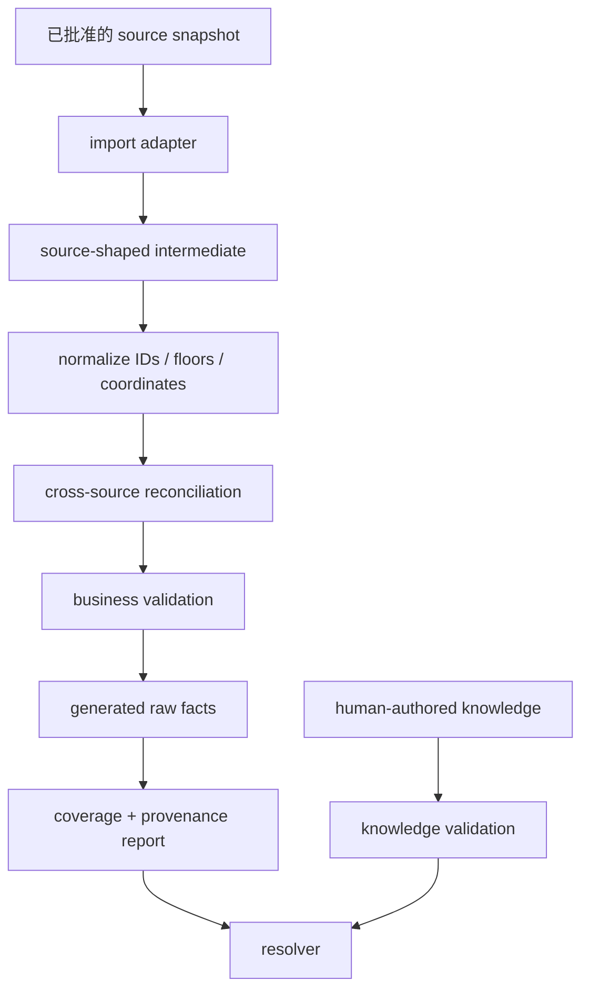

# 数据来源与授权评审

> 本文是工程/产品风险门禁，不构成法律意见。任何标记为 `NEEDS_MANUAL_REVIEW` 的来源，在进入仓库或生产前必须由权利人、条款或明确许可确认。

## 1. 结论

独立重写代码可以显著降低复制 Threechest 代码的风险，但**不能自动解决地图、图片、MDT 数据、攻略文字和 API 数据的权利问题**。代码、数据、图片、商标和 API 条款必须分开判断。

推荐的 V1 来源组合：

- 仓库已有 Blizzard/WCL 相关 ID、名称和 tooltip 能力：复用。
- 用户有权使用的 WCL 服务：用于开发验证和未来日志轻连接，不直接作为 spawn 真相源。
- 地图/美术：本地开发由配置化 provider 加载 Threechest 在线图片；生产使用用户自有 OSS 或占位。
- spawn 坐标/位置信息：项目所有者已确认可从 Threechest 导入规范化快照，保留来源、版本和替换能力。
- S2 轮换目录：以 Blizzard 官方 Midnight Season 2 公告为事实来源；当前 Threechest 克隆的旧 8 本只作为 legacy 坐标/图片开发库存，不得自动标成 S2。
- forces/pack 与其他非坐标事实：由用户确认可用来源或人工维护，不能因坐标决定而自动扩大采用范围。
- 攻略结论：项目自行撰写并保留来源/验证记录，不复制竞品文字。

## 2. 来源矩阵

| 来源                              | 计划用途                                                  | 当前证据/状态                                              | 采用决定                            | 风险与门禁                                                                                           |
| --------------------------------- | --------------------------------------------------------- | ---------------------------------------------------------- | ----------------------------------- | ---------------------------------------------------------------------------------------------------- |
| WoWAnalyzerCN 当前代码/数据       | Spell/NPC/Dungeon 中文映射、tooltip、WCL client、UI token | 当前仓库 AGPL-3.0-or-later；项目自身范围                   | `ADOPT`                             | 保持上游许可与 attribution；不把攻略写进基础表                                                       |
| 用户部署的 WCL API 服务           | 日志/报告请求、未来验证与轻连接                           | 用户明确授权可任意用于本项目；已有 dev/prod 配置           | `ADOPT_WITH_OPERATOR_ASSUMPTION`    | 记录服务负责人、速率/稳定性；不要把密钥写前端或文档                                                  |
| Warcraft Logs 数据/API            | 运行数据与事实交叉验证                                    | 通过现有服务访问；具体 API/数据再分用途                    | `ADOPT_LIMITED`                     | 不假设可批量再分发全部原始日志；保留最小必要派生事实                                                 |
| Blizzard 官方公告/论坛/游戏数据   | S2 池、热修、机制变更依据                                 | 可公开查阅                                                 | `ADOPT_AS_REFERENCE`                | 事实可引用；图片/视频仍需单独许可；保留链接与日期                                                    |
| Threechest 源码                   | 研究交互与架构                                            | GPLv2，本地 clone                                          | `REFERENCE_ONLY`                    | 不复制源码/样式/测试；独立命名与实现；保留设计决策记录                                               |
| Threechest spawn 坐标/位置信息    | 初始规范化 snapshot                                       | 项目所有者明确批准用于本项目                               | `ADOPT_COORDINATES_WITH_PROVENANCE` | 只采用坐标/位置；记录 snapshot/hash/transform；stable ID 不依赖来源顺序；不自动包含 forces/文字/代码 |
| Threechest 其他 JSON/MDT 派生数据 | 模型研究、forces 候选                                     | 非坐标部分未由本次决定批准                                 | `DEV_RESEARCH_ONLY`                 | 未单独确认前不进入 production generated data；`NEEDS_MANUAL_REVIEW`                                  |
| Threechest 地图/图片              | localhost UI 开发远程夹具                                 | 项目所有者允许本地直接加载线上链接；生产来源未确认         | `REMOTE_DEV_ONLY`                   | URL 仅在 gitignored 本地配置；禁止 preview/staging/生产和公开材料；生产 fail/placeholder             |
| MythicDungeonTools                | spawn、forces、map 等潜在上游                             | Threechest 使用其 Git 子模块；需核对项目许可和具体资源来源 | `NEEDS_MANUAL_REVIEW`               | 不因可访问/GPL 项目就推断所有数据和图片可再发布                                                      |
| Keystone.guru                     | 竞品研究、可能的路线链接                                  | 页面提供产品和社区路线；数据/API 条款需另审                | `REFERENCE_ONLY`                    | 不抓取/复制社区路线、地图或文字；如未来调用 API，单独审 Terms                                        |
| Method / Icy Veins / Wowhead      | 攻略交叉验证、Spell 外链/tooltip                          | 有作者和版权内容                                           | `REFERENCE_AS_PROVENANCE`           | 不复制文字、图标集或分类图片；知识由项目重新撰写                                                     |
| 用户自有 OSS                      | 生产地图、背景、缩略图                                    | 用户计划上传；具体文件权利待逐项确认                       | `PREFERRED_PRODUCTION`              | manifest 记录来源、hash、许可/授权说明、上传时间                                                     |
| 人工实测/PTR                      | 机制、Pull、角色建议                                      | 项目维护者自行验证                                         | `PREFERRED_KNOWLEDGE`               | 记录测试版本、角色、层级、验证人；避免把主观经验写成绝对事实                                         |

## 3. 代码许可判断

### 3.1 独立实现是否解决代码权限问题

基本路径是正确的：只研究产品行为和抽象，重新设计 Schema、组件、状态和样式，不复制 Threechest 的表达性代码，可避免将它作为代码基础。

必须保留以下 clean-room 纪律：

- 文档只记录“需要实现的行为/不变量”，不贴 Threechest 代码片段到实施任务。
- WoWAnalyzerCN 中使用新的领域命名、文件结构和测试，不逐文件一一映射。
- 对复杂算法若参考具体实现，优先使用公开标准算法或自行推导，并在代码注释写算法来源，而非复制。
- code review 检查显著相同的常量、注释、测试 fixture、类型命名和组件树。

### 3.2 GPL 与本项目

Threechest 的 GPLv2 许可允许在满足条件时复制/修改代码，但本项目无需依赖这条路径。许可证兼容性并不是唯一判断：即使能满足开源条件，直接搬运仍会增加 attribution、衍生作品边界和长期维护成本。当前推荐是 `REFERENCE_ONLY`。

## 4. 临时图片资源门禁

### 4.1 允许的开发路径

```text
gitignored `.env.local` + dev asset manifest（不放 src/public）
→ RemoteDevAssetProvider（显式 local-only flag）
→ 浏览器直接加载 Threechest 在线图片
→ 本地浏览器 UI 验证
```

允许验证：

- 地图宽高比、缩放、标记密度。
- 不同 floor 切换。
- Pull 高亮、布局响应式。
- 图片缺失/加载失败状态。

### 4.2 禁止路径

- 复制到 `src/**`、`public/**`、Git LFS、Docker image 或 CI artifact。
- 线上 dev/staging/preview 部署。
- 发布 PR 截图、产品宣传图、演示视频。
- 将临时图片 hash/URL 写入 production manifest。
- 通过自建代理、缓存或转存绕过来源站的 CORS、鉴权、限流或防盗链控制。

### 4.3 技术强制

- `.gitignore` 覆盖本地 dev manifest 和 `.env.local`；仓库只提交 generic provider 与配置示例，不提交真实 Threechest URL。
- `VITE_DUNGEON_ASSET_PROVIDER=remote-dev` 在 `PROD`、preview、staging 或非 localhost host 时抛出配置错误。
- production registry 不静态 import dev manifest；CI 在真实 `vite build` 后扫描 `dist`，禁止 `threechest.io`、其实际资源 host、MDT fixture path 和已知 URL。
- `assetKey` 与 URL 分离；更换 OSS 只更新 manifest/provider。
- 无生产资源时使用 `PlaceholderAssetProvider`，不得静默回退临时资源。
- Threechest URL 404、超时或被站点阻止时展示缺图状态；开发流程不依赖远程资源永久稳定。

## 5. 数据管线



每次生成应保存：

- source 名称和 snapshot/version。
- importedAt、生成脚本版本、原始文件 hash。
- 对 NPC/Spell/spawn 的冲突报告。
- 与上一版本的 diff：新增/删除 spawn、forces 变化、技能关系变化。
- 缺失中文名、缺失知识、过期知识列表。

## 6. 交叉验证规则

发布级事实至少满足以下之一：

- 官方/游戏数据 + 实测。
- 两个独立结构化来源一致 + 抽样实测。
- 单一已授权结构化来源 + 全量关键引用校验 + 人工抽样。

发布级攻略建议至少满足：

- 作者实测并由第二位审校者检查。
- 或一位作者交叉参考至少两个来源，明确标为 draft，直到实测。

不要把社区路线热门度当作安全性证据；不要把高层路线直接标为集合石友好。

## 7. Provenance Schema

```ts
interface Provenance {
  type: 'official' | 'game-data' | 'wcl' | 'manual-test' | 'external-reference';
  title: string;
  url?: string;
  author?: string;
  snapshot?: string;
  retrievedAt?: string;
  verifiedAt?: string;
  licenseStatus: 'approved' | 'reference-only' | 'needs-review';
  notes?: string;
}
```

生产校验要求：`published` knowledge 不得只有 `needs-review` 来源；资源 manifest 每个 asset 必须有 `approved` 的授权/来源记录。

### 7.1 Source Registry

一次性人工清单不足以作为发布门。Phase 0 建立版本化 `source-registry`，至少记录：

```ts
interface ApprovedSourceSnapshot {
  sourceId: string;
  snapshotId: string;
  hash: string;
  allowedUses: Array<
    'local-research' | 'commit-derived-data' | 'redistribute' | 'production-asset'
  >;
  approvedBy: string;
  approvedAt: string;
  expiresAt?: string;
  status: 'approved' | 'revoked' | 'expired';
  evidenceRef: string;
}
```

`generate` 和 `publish` 对用途不匹配、未批准、撤回或过期 snapshot 直接失败。Registry 只保存授权证据引用，不提交密钥、私人合同正文或敏感身份信息。

首个 Threechest 坐标 snapshot 应登记为项目所有者批准的 `commit-derived-data`/`redistribute` 用途，`evidenceRef` 指向本决策记录；批准范围只覆盖坐标/位置字段。forces 或其他字段即使位于同一个源文件，也必须使用独立来源记录和批准状态。

## 8. 人工确认清单

进入 Phase 1 前由项目所有者确认：

- [x] Threechest 坐标/位置信息可导入首版规范化数据快照，并保留 provenance/adapter。
- [x] localhost 开发可通过本地配置直接加载 Threechest 在线图片。
- [ ] 生产地图图片的实际来源与可发布权利；未确认时使用占位图。
- [ ] enemy forces 和其他非坐标数据快照的提交/分发来源。
- [ ] WCL 服务的速率、缓存、公开部署和错误处理边界。
- [ ] Blizzard/Wowhead tooltip 的当前调用方式是否延续现有站点策略。
- [ ] 攻略作者/审校者和署名规则。
- [ ] 用户反馈错误后的处理 SLA。
- [ ] 第二审校者或外部领域专家的 owner/backup；单人模式只能推进到 `draft`。
