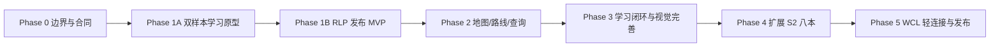

# 分阶段实施计划

## 1. 总体策略

不按“先做八个页面，再补数据”推进，而按“先证明一个完整学习闭环，再扩数据”推进。每个 Phase 都有明确退出标准；未通过不进入规模化。



## 2. Phase 0 — 架构、Schema、来源与开发护栏

### 目标

在 UI 前冻结领域边界、数据合同和资源门禁，证明 S2 真实样本能被表达。

### 任务

1. 建立 `src/dungeon/schema/**`、轻量 season catalog 和生成脚本骨架。
2. 用 Ruby Life Pools 的少量真实样本覆盖：2 个 floor/区域、3 类怪、1 个巡逻、3 个 Pull、1 个 Boss、5 个技能；同时用 Altar of Fangs 的最小样本验证全新副本。
3. 实现 pure validator：ID、引用、坐标、整数 forces points、version、provenance、knowledge completeness。
4. 建立 committed spawn identity registry；reconciliation 输出 exact/auto-match/ambiguous/new/removed，歧义阻断生成，并输出数据版本 diff/migration。
5. 建立 Raw/Knowledge/Resolved resolver，加入稳定 Situation 与 RouteStep coverage；Pull 合并/拆分由引用关系推导，React 不参与数据 join。
6. 建立 Asset Provider 接口、Threechest `remote-dev` provider、本地忽略 manifest、production guard 和 placeholder。
7. 添加 `dungeon:generate`、`dungeon:validate`、`dungeon:report` 和聚合 CI 门 `dungeon:check`。
8. 写最小 authoring fixture 与失败示例，让错误消息指向具体文件/实体。
9. 建立 versioned source registry：登记已确认的 Threechest 坐标 snapshot 与字段白名单；forces/图片等未批准用途不得 generate/publish。
10. 提前提供最小只读 Inspector：ID、floor、坐标、来源、引用；完整地图交互仍留 Phase 2。
11. 冻结诊断合同：错误码、文件/JSON path、实体 ID、snapshot、原因、候选项、可复制修复命令、文档链接、`--json` 和 exit code。
12. 定义 identity 人工解冲命令：查看候选 → accept/reject/override → 写 registry/alias audit → 重跑；禁止手改 generated 文件。

### 交付物

- Schema v1 draft。
- RLP mini fixture + generated data。
- validation/report 输出。
- asset/provider 安全测试。
- data source approval checklist，以及 Threechest 坐标字段白名单/决策证据记录。
- authoring quickstart mini fixture、5 个真实失败示例和诊断快照。

### 退出标准

- 所有跨文件引用错误在命令行可定位。
- 调整源数据顺序不会改变 stable spawn ID。
- 更换 source adapter 的 golden fixture 不改变已确认 identity；ambiguous 不会自动发布。
- `PROD + remote-dev` 必然失败；本地 Threechest URL 不进入 tracked files 或 production bundle。
- resolver 能从相同 raw 数据生成三种角色和多种能力视图，且不复制事实。
- 不修改 parser/analysis。
- 新维护者 5 分钟内能跑通 mini fixture，并从诊断定位一个失败。

## 3. Phase 1A — 双样本学习原型

### 目标

先证明“首次接触的用户能学会”，不是先证明“地图能画出来”或“回归玩家能认出来”。

### 任务

1. 注册内部原型路由或开发预览，不开放八本空壳。
2. RLP 选择 3～5 个关键 Situation + 1 Boss；Altar of Fangs 选择 3 个关键 Situation + 1 Boss。
3. 同时提供 60 秒、5 分钟和完整学习入口。
4. 实现分级 Lesson：Routine/Critical/Transition/Boss。
5. 实现 Situation Lesson、Route Pull 次级编号、Ability Context/Action Row、Role/Capability Advice、Memory Cue。
6. 实现 URL 恢复、上一/下一节点和章节导航。
7. 实现最小主动回忆：先回答/置信度，再揭示；绑定 knowledge fingerprint。
8. 完成内容加载/缺失/过期/tooltip failure 状态。
9. 对新玩家/回归玩家分组，并用现有长文或视频做小型对照；测试即时和次日延迟回忆。

### 退出标准

- RLP 与 Altar of Fangs 都证明用户能明确说出关键机制和对应动作，不能只靠页面完成率。
- 新副本样本的即时/延迟回忆不低于对照方案；阈值在基线测量后冻结。
- 默认学习页不依赖地图成功加载。
- 视觉与 NavigationBar、Theme token、Spell tooltip 一致。
- 两个样本所有 `critical` 知识经过审校并有来源/版本/作者/队伍假设。

## 4. Phase 1B — Ruby Life Pools 发布 MVP

### 目标

把经过验证的学习模型扩成一个可正式发布的完整副本。

### 任务

1. 实现副本列表的完成度、更新时间和占位资源；只有 reviewed 副本可点击。
2. 完成 RLP 所有稳定 Situation、学习友好路线、Boss 和基础怪物反查。
3. 完成 localStorage progress、薄弱项和次日复习。
4. 对完整内容进行作者自测、第二人审校和版本验证。
5. 记录每个 Routine/Critical Situation、每个完整副本的作者工时，校准八本扩展成本。

### 退出标准

- RLP 达到 `published` Definition of Done。
- Altar of Fangs 样本至少保留内部 reviewed 状态，用于回归测试学习模型。
- 首页未完成副本不可进入空壳学习页。
- 有证据的内容工时估算和 Season Pack 排期。

## 5. Phase 2 — 只读地图、路线、怪物与 Boss 查询

### 目标

把空间、Pull 和对象查询接入已成立的学习流程，不改变默认产品重心。

### 任务

1. 实现 SVG `DungeonMap`、纯 coordinate transform、多 floor。
2. Pull list 与地图双向选择、fit bounds、reset current pull。
3. 显示 spawn、boss、POI、pull hull、路线顺序；进行节点性能基准。
4. 只读 Route 页面：路线意图、适用层级、要求、Pull sequence、forces。
5. 先实现从 Situation/Pull 到怪物/技能、从技能返回出现位置的基础反查；高级搜索和全量机制筛选在 RLP 验证有需求后再做。
6. Boss 页面：阶段、核心机制、角色建议、常见失败。
7. 扩展 Phase 0 Inspector：地图点击、group/route/knowledge 反向引用和 revision diff。
8. 本地开发继续使用配置化 Threechest remote provider；部署前替换为 approved OSS。若未就绪，生产继续占位，不延期其他文本体验验证。
9. 用 RLP 最大 floor 基准决定保留 SVG、静态层转 Canvas 或采用小型 map library；记录测量结果。

### 退出标准

- map 与 text list 信息等价，键盘用户不依赖点图。
- 多 floor 深链恢复正确。
- 地图初始加载不进入 `/dungeons` 或其它副本 chunk。
- 典型 RLP spawn 数量下切 Pull 无明显卡顿；超标时有测量报告而非主观判断。
- Route 页面没有任何编辑、导入或保存路线入口。

## 6. Phase 3 — 主动学习、视觉与可访问性完善

### 目标

完成 Read → Recall → Review 的闭环，并将状态/响应式提升到发布质量。

### 任务

1. 每 3～5 节加入先回忆后揭示的 action-based checkpoint 和置信度。
2. 错题/薄弱 Pull 聚合和“进本前 3 条复习”。
3. 使用 Situation/Knowledge 内容指纹，只有实质变化才让相关进度重新进入复习。
4. 完成 desktop/tablet/mobile 三档布局和全状态矩阵。
5. 完成键盘、屏幕阅读器、对比度、reduced motion 审计。
6. 做主题一致性、AI slop、卡片滥用和动画噪声评审。
7. 可选实现打印/简洁复习视图，但只有用户测试证明价值才加入。

### 退出标准

- 学习完成后能只复习错题和薄弱项。
- 关键流程仅键盘可完成。
- 移动端可学习和切 Pull，地图可全屏/折叠。
- 设计 scorecard 各维度达到文档目标或记录有证据的延期。

## 7. Phase 4 — 扩展 Midnight S2 八本

### 目标

验证 Schema 的通用性，并形成可持续内容生产节奏。

### 批次

不建议一次铺开七本，按结构差异分批：

- Batch A：King's Rest、Temple of Sethraliss（旧本重做、多阶段/特殊段落）。
- Batch B：Voidscar Arena、The Blinding Vale（开放路线、分支/组合风险）。
- Batch C：Murder Row、Den of Nalorakk（事件/gauntlet/RP 结构）。
- Batch D：Altar of Fangs（新三 Boss 本，随 S2 实际数据稳定度安排）。
- Batch E：Ruby Life Pools（回归本；既作为垂直切片，也必须重新绑定 S2 版本事实，不能直接把历史 fixture 当作发布内容）。

本批次清单以 `season2DungeonCatalog` 的官方轮换来源为准；Threechest 克隆当前可见的旧 8 本仍只作为独立坐标库存，不能替代 S2 目录或自动提供位置参考。RLP 另有固定到 `origin/ptr` 的当前 S2 PTR 坐标快照，但它只关闭位置参考门，不替代自有 spawn identity、forces 或学习内容审校。

每加入一个特殊机制先判断能否由通用 `Situation`、`TransitionStep`、`EventStep` 或既有 Schema 表达；禁止在组件按 slug hardcode。

### 每本任务模板

1. 注册 metadata/version/status。
2. 导入并校验 floor/map/enemy/spawn/ability/boss。
3. 创建学习友好默认路线。
4. 生成 coverage/missing CN/knowledge 报告。
5. 编写 overview、critical abilities、Pull rationale、Boss、checkpoint。
6. 作者自测 + 第二人审校 + 游戏版本验证。
7. 浏览器 QA、数据测试、视觉回归。
8. 状态从 draft 推进到 reviewed/published。

### 退出标准

- 八本均在覆盖路线图显示；只有 reviewed/published 可打开正式学习，状态真实。
- 八本 raw 数据和 route 引用通过校验。
- 至少 RLP 达到完整 reference implementation；其余未完成内容明确“建设中”。
- 没有 Dungeon-specific UI 分支，或每个例外有 architecture decision record。

## 8. Phase 5 — WCL 轻连接与发布

### 目标

在不改分析引擎的前提下建立 Learn 与现有 Review 的入口联系。

### 任务

1. 副本页“分析我的这个副本日志”跳到现有 report/search 流程。
2. 在现有报告可稳定识别 Dungeon 时提供“查看副本攻略”深链；单独、小范围改动。
3. 定义未来 `DungeonRunKnowledgeAdapter` 接口和稳定 Knowledge ID 映射，不实现分析器。
4. 生产 asset/license 清单最终签核。
5. 执行全套验证、构建、Playwright、bundle 分析、Sentry/日志验证。
6. 建立热修响应和内容 stale 监控。
7. 提供发布/回滚 runbook：impact report → 局部 stale/下线 → 定向校验 → preview → publish revision → rollback previous manifest/release。

### 退出标准

- 双向导航不改变 CombatLogParser 行为。
- `localhost:9528` 与 production WCL base 的现有测试继续通过。
- 生产不含任何 dev-only/未授权资源。
- 发布 checklist、回滚方案、内容 owner 和更新 SLA 明确。

## 9. 文件级实施任务图

实际文件名可在 Phase 0 调整，改动边界应保持：

| 区域                | 主要新增                              | 现有文件修改                      |
| ------------------- | ------------------------------------- | --------------------------------- |
| Schema/Runtime      | `src/dungeon/schema/**`, `runtime/**` | 无                                |
| Generated/Knowledge | `src/dungeon/data/**`, `knowledge/**` | 无                                |
| UI                  | `src/dungeon/ui/**`                   | 无                                |
| Routes              | `src/interface/routes/dungeons/**`    | `src/interface/App.tsx` 一处注册  |
| Entry               | 新增导航 icon/entry component         | `HomeLayout.tsx` 小改或独立入口   |
| Scripts             | `scripts/dungeons/**`                 | `package.json` 脚本               |
| WCL navigation      | 小型 adapter/link                     | 现有 report 页极少量修改，Phase 5 |
| Tests               | Dungeon 自有 unit/UI/E2E              | 只补通用 test setup（如必要）     |

## 10. 测试执行顺序

每个 Phase 的 PR 至少运行受影响测试；发布候选运行：

```bash
pnpm dungeon:generate --check
pnpm dungeon:check
pnpm typecheck
pnpm lint
pnpm test
pnpm build
pnpm e2e
```

当前仓库历史基线问题与 Dungeon 新增问题必须分开记录。任何新失败不能以“仓库本来有失败”为理由放行。

`dungeon:check` 至少包含：reconciliation reorder/drift/ambiguity golden tests、跨文件负例、resolver deterministic、manifest/loader 一致性、lazy chunk 隔离、非法深链 canonical replace、storage 故障、SVG transform/多层，以及 production dist 不含 remote-dev URL/manifest。

CI 分层：PR 只跑 changed-dungeon 快速门并上传失败摘要；nightly/release 跑八本全量、bundle、provenance、reconciliation、coverage 和 fixture 扫描。每个报告必须给出具体待改文件，历史基线用显式 allowlist，禁止无限吞掉新失败。

## 11. 估算与并行边界

估算应在 RLP 内容样本完成后校准。可并行的只有低耦合工作：

- 已冻结 Schema 后，地图组件与内容 authoring 可并行。
- 同一副本 raw reconciliation 与 route authoring 不宜盲目并行，因为 spawn ID 会影响路线。
- 八本扩展可按 Batch 并行，但每批共享一位 Schema owner，避免各自增加特例。
- 视觉 token/机制语言冻结前，不批量生产卡片样式。

## 12. 实施前必须决定

1. 生产 map/artwork 的批准来源。
2. Threechest 坐标/位置信息已批准作为初始快照；仍需确认 enemy forces 与其他非坐标事实的可提交和分发来源。
3. RLP 内容作者、第二审校者与版本验证方式。
4. S2 PTR 还是 live 作为 Phase 1 数据基线；建议数据结构支持 PTR，但 public published 以 live 为准。
5. 每本生成 payload 采用 JSON + typed index 还是 TypeScript data；默认优先前者，并以 typecheck/build 体积实测确认。

若当前只有单一维护者：允许事实和知识进入 internal/draft preview，也允许单人立即把错误内容标 stale/下线；恢复为 `published` 仍需要已指定的第二审校者。

其余技术选择（local state、SVG、按本 dynamic import、placeholder）已有低风险默认方案，可以在 RLP 样本中用测量推翻，而不是提前扩大讨论。

## GSTACK REVIEW REPORT

| Review        | Trigger                         |            Why | Runs | Status      | Findings                                                                |
| ------------- | ------------------------------- | -------------: | ---: | ----------- | ----------------------------------------------------------------------- |
| CEO Review    | `autoplan / product`            |   范围与差异化 |    1 | ISSUES OPEN | 13 项建议，11 项纳入，2 项延期；4 个授权/运营决定待项目所有者确认       |
| Outside Voice | 独立 review agents              | 对抗性第二意见 |    4 | FOLDED      | Situation 主键、双样本、学习模式、identity registry、内容 DX 已折回文档 |
| Eng Review    | `autoplan / plan-eng-review`    |     架构与测试 |    1 | ISSUES OPEN | 12 项工程问题已修入计划，0 个已知架构 critical gap；4 个外部决定待确认  |
| Design Review | `autoplan / plan-design-review` |          UI/UX |    1 | ISSUES OPEN | 6.8/10 → 8.9/10 计划目标，14 项设计决定已纳入                           |
| DX Review     | `autoplan / plan-devex-review`  |   内容维护体验 |    1 | ISSUES OPEN | 5.5/10 → 9.0/10 计划目标；工具 TTHW 60–120m → 30m                       |

**CROSS-MODEL:** 产品、设计、工程与内容维护评审一致认为：学习必须绑定稳定 Situation，不绑定 Pull 编号；RLP 完整切片需配合一个全新副本样本；未授权资源与不明确 identity 均不能进入发布链路。

**VERDICT:** Threechest 坐标与 localhost 远程图片路径已经确认，方案可进入 Phase 0 本地开发；在下面四项确认前不得进入生产发布。

**UNRESOLVED DECISIONS:**

- 生产地图/图片的批准来源与可部署/再分发范围。
- enemy forces 与其他非坐标事实 snapshot 的可提交、可派生和可再分发来源。
- RLP/Altar 攻略作者、第二审校者、backup 与审校时限。
- 首版 live 目标 key range、集合石队伍假设和“学习友好路线”的具体验收口径。
